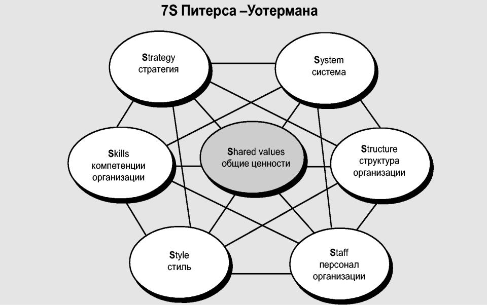

# Пять сил конкуренции М. Портера и их влияние на выбор стратегии предприятия

//TODO Прописать их влияние на выбор стратегии предприятия

Анализ пяти сил конкуренции, предложенный Майклом Портером в 1979 году, представляет собой универсальный инструмент для оценки конкурентной среды любой отрасли. Метод помогает предприятиям понять, какие факторы влияют на их позицию на рынке и какие стратегии следует применять для успешной конкуренции.

---

### **1. Угроза появления продуктов-заменителей**

**Суть:**  
Продукты-заменители — это товары или услуги, которые могут удовлетворить те же потребности, что и предлагаемые предприятием. Их появление может снизить спрос на существующий продукт.

**Примеры:**

- Лошадиные повозки были вытеснены автомобилями.
- Фотопленки практически исчезли с рынка из-за цифровых камер.
- Домашние проводные телефоны заменяются мобильными.

**Анализ факторов влияния:**

- **Склонность потребителей**: Насколько легко клиент готов переключиться на продукт-заменитель.
- **Цена и качество**: Соотношение стоимости и пользы продукта-заменителя.
- **Стоимость переключения**: Затраты потребителей на переход к новому продукту.
- **Восприятие дифференциации**: Уникальность текущего продукта по сравнению с заменителями.

_Пример:_  
Скоростной поезд «Сапсан» от РЖД конкурирует с авиаперевозками между Москвой и Санкт-Петербургом, предлагая более низкую цену и комфорт.

---

### **2. Угроза появления новых игроков**

**Суть:**  
Вход новых конкурентов на рынок может привести к увеличению конкуренции, снижению прибыли и утрате доли рынка.

**Факторы, влияющие на сложность входа:**

- **Барьеры входа**: Лицензии, патенты, дефицит квалифицированных специалистов.
- **Стартовые затраты**: Высокие инвестиции для выхода на рынок.
- **Утопленные издержки**: Инфраструктура или технологии, которыми обладают старые игроки.

**Пример:**  
Компания Yota потратила больше средств на установку базовых станций для 4G по сравнению с «МегаФоном», у которого уже была инфраструктура.

---

### **3. Рыночная власть поставщиков**

**Суть:**  
Поставщики могут диктовать условия предприятиям, увеличивать цены на ресурсы или снижать качество поставок, что влияет на рентабельность компании.

**Факторы влияния:**

- Уникальность поставляемых ресурсов.
- Концентрация поставщиков.
- Возможность замены поставщика.
- Зависимость отрасли от конкретных поставщиков.

_Пример:_  
Производители процессоров, такие как Intel, имеют высокую рыночную власть из-за ограниченного числа альтернатив.

---

### **4. Рыночная власть потребителей**

**Суть:**  
Потребители могут оказывать влияние на бизнес, требуя более низких цен, лучшего качества или улучшенного сервиса.

**Факторы влияния:**

- Концентрация покупателей (многие клиенты или несколько крупных).
- Доступность альтернативных предложений.
- Чувствительность к цене.

_Пример:_  
В сфере авиаперевозок клиенты легко переключаются между конкурентами, такими как Ryanair и Wizz Air, благодаря схожим ценам и услугам.

---

### **5. Уровень конкурентной борьбы**

**Суть:**  
Конкуренция между существующими игроками в отрасли определяет стратегические действия компаний для удержания или расширения своей доли рынка.

**Факторы:**

- Количество конкурентов и их размер.
- Темпы роста рынка.
- Дифференциация продуктов.
- Барьеры для выхода из рынка.

_Пример:_  
На рынке фастфуда крупные игроки, такие как McDonald’s, Burger King и KFC, постоянно конкурируют за привлечение клиентов через акции, улучшение меню и технологии обслуживания.

---

### **Заключение**

Анализ пяти сил Портера помогает компаниям оценить свою конкурентную среду и принять обоснованные стратегические решения. Для успешного ведения бизнеса важно учитывать:

1. Угрозу продуктов-заменителей.
2. Возможность появления новых игроков.
3. Влияние поставщиков.
4. Требования потребителей.
5. Уровень внутренней конкуренции.

**Вывод:**  
Компании, которые используют метод Портера, способны адаптировать свои стратегии и сохранить конкурентоспособность, даже в условиях интенсивной конкуренции.
