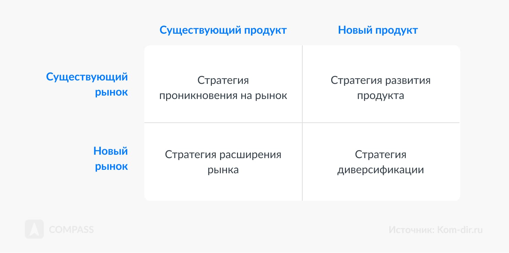

# Типы стратегий поведения фирмы на рынке

Для успешного функционирования на рынке каждая фирма должна определить свой подход к конкуренции, учитывая свои цели, ресурсы и рыночные условия. Эти подходы формируют основу стратегий поведения компании, которые позволяют ей не только сохранять позиции, но и развиваться, несмотря на давление конкурентов.

---

### **1. Конкурентные стратегии Майкла Портера**

Майкл Портер выделил три основные стратегии, которые определяют пути достижения конкурентного преимущества:

#### **1.1. Стратегия лидерства в издержках**

Цель — минимизировать издержки, чтобы предложить клиентам товар или услугу по самой низкой цене на рынке.  

- **Где применима:** отрасли с высокой ценовой конкуренцией и незначительными различиями в продуктах.
- **Пример:** **Walmart** активно снижает издержки за счет масштабных закупок и оптимизации цепочек поставок, предлагая низкие цены.

#### **1.2. Стратегия дифференциации**

Цель — предложить уникальный продукт, который будет выделяться на фоне конкурентов благодаря своим характеристикам.  

- **Где применима:** отрасли, где потребители готовы платить за уникальность.  
- **Пример:** **Dyson**, выпускающий бытовую технику с уникальным дизайном и передовыми технологиями.

#### **1.3. Стратегия фокусирования**

Цель — сосредоточиться на узкой группе потребителей или сегменте рынка.  
- **Подтипы:**
  - Фокус на издержках: снижение затрат для работы в узкой нише.
  - Фокус на дифференциации: создание уникального продукта для конкретного сегмента.
- **Пример:** фреш-бары, предлагающие эксклюзивные свежевыжатые соки по запросу клиента.

---

### **2. Матрица Ансоффа: стратегии роста**

Матрица Ансоффа помогает выбрать направление роста компании, исходя из комбинации текущих и новых продуктов и рынков.

#### **2.1. Проникновение на рынок**

Цель — увеличить долю на существующем рынке с помощью текущих продуктов.  
- **Пример:** усиление маркетинговых кампаний и скидок для повышения продаж.

#### **2.2. Развитие продукта**

Цель — создание нового продукта для существующих клиентов.  
- **Пример:** автопроизводители добавляют электромобили в линейку бензиновых автомобилей.

#### **2.3. Развитие рынка**

Цель — вывод текущих продуктов на новые рынки.  
- **Пример:** выход местной сети кофеен на международный рынок.

#### **2.4. Диверсификация**

Цель — выпуск новых продуктов для новых рынков.  
- **Пример:** IT-компания, переходящая в производство бытовой электроники.

---

### **3. Конкурентные стратегии Котлера**

Филипп Котлер предложил классификацию стратегий в зависимости от положения компании на рынке.

#### **3.1. Лидер**

Компания, которая занимает ведущую позицию на рынке и стремится удерживать её:
- Увеличение объемов продаж, географии сбыта.
- Укрепление бренда.  
- **Пример:** **Coca-Cola** — лидер на рынке безалкогольных напитков.

#### **3.2. Претендент**

Компания, стремящаяся вытеснить лидера:
- Агрессивные рекламные кампании.
- Поиск слабых мест конкурентов.  
- **Пример:** **Pepsi**, конкурирующая с Coca-Cola.

#### **3.3. Последователь**

Фирма копирует успешные стратегии лидеров, не стремясь открыто конкурировать:
- Предложение бюджетных аналогов.
- Сохранение стабильной клиентской базы.  
- **Пример:** местные бренды, копирующие популярные глобальные продукты.

#### **3.4. Нишевой игрок**

Сосредотачивается на специфической целевой аудитории:
- Предлагает уникальные решения для узкого сегмента.  
- **Пример:** компании, производящие медицинское оборудование для редких заболеваний.

---

### **4. Прочие стратегии поведения**

#### **4.1. Снятие сливок**

Высокие цены на новый продукт для получения максимальной прибыли от небольшого сегмента платежеспособных клиентов.  
- **Пример:** выпуск флагманских смартфонов.

#### **4.2. Стратегия проникновения**

Снижение цен для завоевания доли рынка.  
- **Пример:** потоковые платформы, предлагающие бесплатные пробные периоды.

#### **4.3. Международные стратегии**

Выход на глобальные рынки, адаптация продуктов и маркетинга под местные особенности.  
- **Пример:** **McDonald's**, адаптирующий меню под предпочтения регионов.

---

### **Как выбрать стратегию**

При выборе стратегии необходимо учитывать:

1. **Цели компании:** долгосрочные и краткосрочные.
2. **Особенности отрасли:** динамика спроса, уровень конкуренции.
3. **Ресурсы:** финансовые, технологические, кадровые.
4. **Позицию на рынке:** лидерство, претендентство или нишевой подход.
5. **Анализ внешней среды:** пять сил Портера помогут оценить угрозы и возможности.

---

### **Вывод**

Выбор стратегии поведения на рынке — это ключ к долгосрочному успеху. Компании, которые грамотно анализируют свою среду, понимают своих клиентов и конкурентов, могут эффективно применять стратегии и обеспечивать себе устойчивое развитие.
